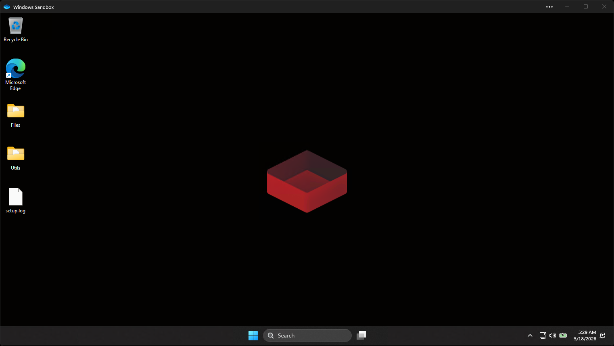

<h1 align="center">RedSand</h1>
<div align="center">
  <br>
  Windows Sandbox environment for cybersecurity enthusiasts<br><br>
  <a href="https://github.com/redcode-labs/RedSand/actions/workflows/ci.yml"></a>
  <a href="https://github.com/redcode-labs/RedSand/releases">Releases</a>
</div>

## About

RedSand is a set of pre-made `.wsb` profiles that spin up a Windows Sandbox tailored for security work — just double-click one. Each profile maps a read-only `Utils/` folder (scripts, toolkits) plus the host folders appropriate for its workflow, then runs a setup script on logon.

Modify the `.wsb` and `.ps1` files freely to match your workflow. Contributions of all kinds — new scripts, `.wsb` tweaks, documentation — are welcome.

## Gallery

<p align="center">
  
</p>

<p align="center"><sub><i>Post-logon boot — dark theme and RedSand wallpaper applied by setup.ps1.</i></sub></p>

## Quick start

1. Enable the Windows Sandbox feature (one-time, requires Windows 10/11 Pro / Enterprise / Education):
   ```powershell
   # Run as Administrator
   .\Utils\Scripts\AdditionalScripts\OnHost\enableSandboxFeature.ps1
   ```
   Reboot if prompted.
2. Pick a profile from `profiles/` and double-click it. Start with `profiles\RedSand.wsb` if unsure.
3. The sandbox boots, `setup.ps1` runs automatically, and you land on a desktop ready to work.

**Tip:** For first-time setup, `Utils\Scripts\AdditionalScripts\OnHost\prepareForRedSand.ps1` orchestrates step 1 (feature check) and pre-stages tools in `Utils/Toolkits/` so the strict profiles have something to work with — interactive picker, or pass `-All` to grab everything.

## Profiles

Pick the profile that matches your workflow. All profiles share the same `setup.ps1` (dark theme, dev mode, wallpaper, ExecutionPolicy) — they differ in sandbox isolation knobs and which host folders are mapped.

| Setting | `RedSand.wsb` (default) | `RedSand-Analysis.wsb` | `RedSand-Forensics.wsb` |
|---|---|---|---|
| **Audience** | General-purpose | RE / static + dynamic binary analysis | Triaging evidence images |
| `Networking` | Default | **Disable** | **Disable** |
| `ClipboardRedirection` | Disable | Disable | Disable |
| `ProtectedClient` | Enable | Enable | Enable |
| `AudioInput` | Default | **Disable** | **Disable** |
| `VideoInput` | Default | **Disable** | **Disable** |
| `PrinterRedirection` | Default | **Disable** | **Disable** |
| `VGpu` | Default | **Disable** | Default |
| `MemoryInMB` | 4096 | 4096 | **8192** |
| `Files/` mapping | read-write | — | — |
| `Input/` mapping | — | **read-only** | **read-only** |
| `Output/` mapping | — | **read-write** | **read-write** |
| `Utils/` mapping | read-only | read-only | read-only |

- **Default** — general-purpose; `Files/` is read-write scratch space.
- **Analysis** — drop samples into `Input/` *before launch* (it's read-only inside, so the sample can't tamper with the original or delete itself). Analysis artifacts land in `Output/`. The wsb has commented-out auto-run hints for: Defender disable, lightweight tool pack, and REtoolkit — uncomment what you need. Tool installs require network on first boot.
- **Forensics** — drop evidence images into `Input/` *before launch*. Notes/exports land in `Output/`. Same isolation as Analysis but vGPU stays on for image-viewer responsiveness. Commented hints for Defender disable and a narrow forensics tool pack are in the wsb.

Each profile's `.wsb` has the `Output/` mapping clearly marked — comment that `MappedFolder` block out if you want a sandbox with zero writable host mappings.

**If you pick a network-off profile (Analysis / Forensics), run the on-host downloader scripts first** so the tools you need are pre-staged in `Utils/Toolkits/` before launch — once the sandbox boots there's no way to fetch them.

What `setup.ps1` does on every profile:

- Sets ExecutionPolicy to `Unrestricted` (sandbox-local, throwaway)
- Enables developer mode (`AllowDevelopmentWithoutDevLicense`)
- Switches to dark theme
- Applies the RedSand wallpaper

## Directory layout

```
RedSand/
├── profiles/                   # Sandbox configs — double-click one to launch
│   ├── RedSand.wsb             # Default
│   ├── RedSand-Analysis.wsb    # No network, max isolation, read-only Input/
│   └── RedSand-Forensics.wsb   # No network, 8 GB, read-only Input/
├── Files/                      # Read-write scratch (default profile only)
├── Input/                      # Read-only sample / evidence drop (Analysis + Forensics)
├── Output/                     # Read-write results dir (Analysis + Forensics)
├── Tools/                      # Read-only BYO tools (mapped by every profile, see Customization)
└── Utils/
    ├── Toolkits/               # Tools downloaded by OnHost scripts land here
    └── Scripts/
        ├── DefaultScripts/     # Run automatically on logon (every profile)
        │   └── setup.ps1
        └── AdditionalScripts/
            ├── OnHost/         # Run these on your host before launching
            └── InSandbox/      # Run these inside the sandbox (manual or via wsb)
```

`Utils/` is always mapped read-only. `Files/` is mapped read-write only by the default profile. `Input/` is mapped read-only by Analysis and Forensics; `Output/` is mapped read-write by the same two. Anything you download on the host into `Utils/Toolkits/` (via the OnHost scripts) becomes available inside the sandbox at `C:\users\WDAGUtilityAccount\Desktop\Utils\Toolkits\`.

## Scripts reference

### On-host (run before launching the sandbox, from your normal Windows session)

| Script | What it does |
|---|---|
| `prepareForRedSand.ps1` | One-shot orchestrator. Checks the sandbox feature is enabled, then runs the downloader scripts below (interactive picker, or `-All` / `-Sysinternals` / `-Zimmerman` flags). |
| `enableSandboxFeature.ps1` | Enables the Windows Sandbox optional feature. Requires admin; may need a reboot. |
| `downloadSysinternalsSuite.ps1` | Downloads SysinternalsSuite into `Utils/Toolkits/SysinternalsSuite/`. |
| `downloadZimmermanTools.ps1` | Fetches Eric Zimmerman's forensics tools into `Utils/Toolkits/Zimmerman/`. |
| `build-wsb.ps1` | Interactive `.wsb` builder. Walks through every Windows Sandbox setting and writes a configuration file. Output path is freeform (relative or absolute). |
| `build-toolkit-installer.ps1` | Interactive generator for scoop-based tool-pack installers (same shape as `installAnalysisTools.ps1`). Pick buckets, list tools, choose global (sandbox / admin) or per-user scope; writes a runnable `.ps1`. |

To run any OnHost script, open PowerShell in the repo root:

```powershell
powershell.exe -ExecutionPolicy Bypass -File .\Utils\Scripts\AdditionalScripts\OnHost\<script-name>.ps1
```

`prepareForRedSand.ps1` is the recommended starting point for first-time setup.

### In-sandbox (run inside the VM, manually or by wiring into a profile's `.wsb`)

| Script | What it does |
|---|---|
| `installChocoAndScoop.ps1` | Installs both [Scoop](https://scoop.sh) and [Chocolatey](https://chocolatey.org). Prerequisite for the tool-pack installers below. |
| `installAnalysisTools.ps1` | Lightweight RE pack via scoop: dnSpy, HxD, PE-bear, Detect It Easy, x64dbg, System Informer (formerly Process Hacker), Wireshark. |
| `installForensicsTools.ps1` | Narrow forensics pack via scoop: HxD, ExifTool (complements pre-staged Sysinternals + EZ tools). |
| `installREToolkit.ps1` | Downloads the latest [REtoolkit](https://github.com/mentebinaria/retoolkit) release and runs the silent installer. |
| `disableDefender.ps1` | Disables Defender **inside the sandbox only** (host untouched). Use when samples would otherwise be quarantined. |
| `excludeInputFromDefender.ps1` | Softer alternative — keeps Defender running but adds `Input/` to its exclusion list. |
| `godMode.ps1` | Creates a "God Mode" control-panel folder on the desktop. |
| `customScript.ps1` | Empty hook — drop whatever you want auto-run here. |

To auto-run any in-sandbox script on logon, uncomment the matching line in your chosen profile's `.wsb`:

```xml
<Command>powershell.exe -ExecutionPolicy Bypass -File C:\users\WDAGUtilityAccount\Desktop\Utils\Scripts\AdditionalScripts\InSandbox\installREToolkit.ps1</Command>
```

> NOTE: if you want to use any script that requires network connectivity (`installREToolkit.ps1` OR `installChocoAndScoop.ps1` and dependent on it `installAnalysisTools.ps1`/`installForensicsTools.ps1`) in 'Analysis' or 'Forensics' profile - please toggle `<Networking>Default</Networking>` in respective `.wsb` file.

## Customization

The `.wsb` schema is documented by Microsoft: [Windows Sandbox configuration](https://learn.microsoft.com/en-us/windows/security/threat-protection/windows-sandbox/windows-sandbox-configure-using-wsb-file).

Common tweaks:

- **More RAM** — bump `<MemoryInMB>`
- **Re-enable clipboard** — set `<ClipboardRedirection>Enable</ClipboardRedirection>` (handy for paste-in samples, but breaks the isolation guarantee)
- **GPU passthrough** — already `Default`; change to `Disable` if you want strict CPU-only execution
- **Extra logon commands** — add more `<Command>` entries in `<LogonCommand>`

For one-off in-sandbox setup, edit `customScript.ps1` and uncomment its `<Command>` line in your profile's wsb — keeps your customizations out of the always-run `setup.ps1`.

If you don't want a profile's writable `Output/` mapping persisting state on the host, comment out the `Output/` `MappedFolder` block in that wsb (it's marked with an inline comment).

### Custom profiles and tool packs

Two interactive builders generate new `.wsb` profiles and scoop tool-pack installers without hand-editing XML or PowerShell:

```powershell
# Build a custom .wsb (prompts for each isolation knob + mapped folders)
powershell.exe -ExecutionPolicy Bypass -File .\Utils\Scripts\AdditionalScripts\OnHost\build-wsb.ps1

# Generate a scoop-based tool-pack installer
powershell.exe -ExecutionPolicy Bypass -File .\Utils\Scripts\AdditionalScripts\OnHost\build-toolkit-installer.ps1
```

The tool-pack builder asks for install scope — pick **Global** for the sandbox (admin install via scoop's `--global`) or **Per-user** if you're generating something for your everyday machine. The generated script adapts: per-user output drops the `#Requires -RunAsAdministrator` line and the `--global` flag, so the same builder works for both RedSand and standalone use.

### Using your own tools (`Tools/`)

Every profile maps `Tools/` read-only into the sandbox at `C:\users\WDAGUtilityAccount\Desktop\Tools\`. Three ways to put things there:

1. **Drop files directly.** Copy a portable tool's folder (e.g. an extracted `dnSpy/`) into `Tools/`. It shows up inside the sandbox immediately on next launch.
2. **Junction to an existing host install.** If a tool already lives somewhere on your host (e.g. `C:\Program Files\IDA Free 9.0`), create a directory junction without copying anything:
   ```cmd
   mklink /J Tools\IDA "C:\Program Files\IDA Free 9.0"
   ```
   `/J` doesn't require admin (unlike `/D` symlinks). The sandbox sees `Desktop\Tools\IDA\` mapped to that host directory — read-only, so the sandbox can't mutate your install.
3. **Map an arbitrary host path directly in a wsb.** When a tool lives somewhere awkward (different drive, path with spaces, etc.) and you don't want a junction, add a `MappedFolder` to your profile's `.wsb` with an explicit `<SandboxFolder>` destination:
   ```xml
   <MappedFolder>
     <HostFolder>D:\Reverse Engineering\Binary Ninja</HostFolder>  <!-- where it lives on YOUR machine -->
     <SandboxFolder>C:\BinaryNinja</SandboxFolder>                 <!-- where it appears INSIDE the sandbox -->
     <ReadOnly>true</ReadOnly>
   </MappedFolder>
   ```
   `<HostFolder>` is the source on the host; `<SandboxFolder>` is the *destination* inside the VM. Omit `<SandboxFolder>` and the mapping defaults to `C:\users\WDAGUtilityAccount\Desktop\<basename>\` — fine for most folders, but `<SandboxFolder>` is useful when (a) you want a clean path like `C:\BinaryNinja\` that scripts inside the sandbox can reference, (b) two host folders share a basename and would collide on the default Desktop scheme, or (c) the host folder name contains spaces and you'd rather not navigate `Desktop\Binary Ninja\` in PowerShell.

   **Don't want to hand-edit XML?** `build-wsb.ps1` handles this interactively. When you say yes to "Add another mapped folder?" it prompts for:
   ```
     Host path (any: ..\Input\, or absolute like D:\Tools\Binja): D:\Reverse Engineering\Binary Ninja
     Read-only? [Y/n]: y
     Map to a specific path inside the sandbox (defaults to Desktop\<folder name>)? [y/N]: y
       Sandbox path (e.g. C:\BinaryNinja): C:\BinaryNinja
   ```
   The generated wsb gets a `MappedFolder` block with both `<HostFolder>` and `<SandboxFolder>` set. The summary screen shows custom destinations as `host -> sandbox` so you can verify before writing.

`Tools/` itself is gitignored, so anything you put there stays local to your machine.

## Security notes

A few things worth knowing before you drop sensitive material into the sandbox:

- **`Files/` persists on the host.** The sandbox VM is destroyed on shutdown, but anything written to `C:\users\WDAGUtilityAccount\Desktop\Files\` from inside is the same bytes as `./Files/` on your host. Treat that folder as host filesystem, not sandbox memory — don't put credentials there, and be careful about what malware artifacts you drop into it.
- **Don't analyze live evasive malware here.** Windows Sandbox is a convenience VM, not a research-grade analysis environment. Samples that fingerprint sandboxes, attempt escape via shared kernel surface, or rely on Hyper-V tricks may behave unexpectedly. Use REMnux / FLARE-VM on dedicated hardware for that.
- **Defaults are a baseline, not a guarantee.** RedSand ships with `ProtectedClient`, clipboard disabled, and a fixed memory cap, but networking is on by default. Tighten the `.wsb` further if your threat model requires it.
- **Bootstrap scripts run remote code.** `installChocoAndScoop.ps1` and `installREToolkit.ps1` execute code fetched from upstream over HTTPS — this is the documented install pattern for those projects, but it does mean a compromised upstream becomes a compromised sandbox. The sandbox's disposability is your main mitigation.
- **WSL doesn't work inside Windows Sandbox.** WSL2 needs nested virtualization, and the `.wsb` schema doesn't expose a knob to enable it. If you need Linux tooling inside the sandbox, look at Cygwin / MSYS2, or run scripted tools via portable Python / Node installed through scoop / choco.

See [SECURITY.md](SECURITY.md) for reporting vulnerabilities.

## Contributing

See [CONTRIBUTING.md](CONTRIBUTING.md). New `.ps1` scripts, `.wsb` tweaks, and doc improvements all welcome. CI runs PSScriptAnalyzer, parses every script, and validates the `.wsb` XML — please make sure it goes green.

## Credits

Heavily influenced by and reusing concepts from:

- [Sandbox](https://github.com/firefart/sandbox) by [@firefart](https://github.com/firefart)
- [Customize Windows Sandbox](https://techcommunity.microsoft.com/t5/itops-talk-blog/customize-windows-sandbox/ba-p/2301354) by Thomas Maurer
- countless people on forums

### 3rd-party tools

- [REtoolkit](https://github.com/mentebinaria/retoolkit) by [@mentebinaria](https://github.com/mentebinaria)
- [Get-ZimmermanTools](https://ericzimmerman.github.io/) by [@EricZimmerman](https://github.com/EricZimmerman)
- [SysinternalsSuite](https://learn.microsoft.com/en-us/sysinternals/downloads/sysinternals-suite) by Microsoft
- Windows Sandbox logo by Microsoft

## License

[ISC](LICENSE)
